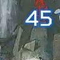
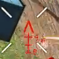
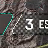
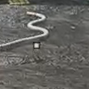

# FPS Highlighter

Are you looking to create a highlights of your *best moments* in Apex Legends? Look no further! With this script, you can easily filter through your gameplay footage and extract only the most action-packed and exciting moments. Simply install and use this tool and let the script do the rest. The resulting video clip will feature all the *high-stakes battles* and *triumphant victories* you want to remember, without any of the dull downtime in between. Whether you're a seasoned pro or a newcomer to the game, this script is a must-have tool for any Apex Legends fan looking to relive their greatest moments.

Not happy with the result? Fine thune the dataset in minutes! Add a few images to the dataset with the thing you want/don't want and you are good to go!

Note that this script can also be used for other games: if it is possible to decide if a frame is interesting or not, only based on the content of the frame (and not the one before or the one after or the sound), then it is possible to use this script to filter through your game records.

Want to see what a highlights looks like? Check out this [video](https://streamable.com/46ze89)! You can see that anything that isn't a kill or damage dealt is filtered out. The original  video is 2 mins long, but the highlights are only 48 seconds long.

## Features

- Automatically filters through gameplay footage and extracts only the most exciting moments
- Uses a machine learning model to classify frames as interesting or not
- Can be used to filter through any video file, not just Apex Legends gameplay footage (provided you create your own dataset)
- Can be used to filter through multiple video files at once
- Decide how many seconds of footage to include before and after each interesting frame
- Lightweight and easy to use

## Fast Start

### with the provided model
- Install Python (for the ones that know what they are doing, use a virtual environment)
- Install the dependencies
- Download this [model](https://drive.google.com/file/d/11_Zoim-StTNyQd62MSAv2JyK4VA-msA1/view?usp=sharing) `resnet18.pth` and place it in `inputs\models`.
- In `main.py`, set the `folder` variable to the path to the directory containing the video files to be filtered.
- Run the script using `python main.py` and wait for the script to finish.
- Enjoy your new highlights!

### with your own dataset
- Install Python (for the ones that know what they are doing, use a virtual environment)
- Install the dependencies
- In `main.py`, set `generate_inputs=True`. This will generate the inputs for the machine learning model.
- Sort the inputs in the `inputs` folder into 2 folders: `true` and `false`. The `true` folder contains the interesting frames, and the `false` folder contains the not interesting frames. You need to get at least 2k images in total. 
- You can download my dataset (40k images).
- You can also use the `randomize.py` script to randomize the train and test sets, and verify that all files are valid. CAUTION: this will delete the trained models.
- Train the machine learning model using `ml.py`. This should not take too long (less than one hour on my computer).
- In `main.py`, set `generate_inputs=False`. This will use the machine learning model to filter the video.
- In `main.py`, set the `folder` variable to the path to the directory containing the video files to be filtered.
- Run the script using `python main.py` and wait for the script to finish.
- Enjoy your new highlights!

## Tips

- Use PyPy instead of Python to speed up the script.
- Use PowerToys to block the pc from going to sleep while the script is running.
- You can use Instant Replay (or any other software) to record only the last X seconds of your gameplay. This will reduce the size of the video files and the time needed to process them.

## Dependencies

Use the following command to install the dependencies:

`pip install -r requirements.txt`

## Files

- `main.py`: main script
- `ml.py`: machine learning script
- `graphs.py`: script for generating graphs
- `apex_highlights.py`: all the functions
- `randomize.py`: randomize the train and test sets, verify if all files can be opened with PIL (CAUTION: this will delete the trained models)
- `requirements.txt`: list of dependencies

## Dataset

The dataset is composed of 2 folders: `true` and `false`.
- `true`: interesting frames
  - hit markers
  - damage visible on screen
  - 3 teams left
  - victory
  - last seconds of a heal or shield
- `false`: not interesting frames
  - nothing happens in the game
  - every screenshot that isn't Apex Legends

You may have complement the dataset with other images. Make sure to have diverse images in your dataset:
- different backgrounds: sky, buildings, explosions, etc.
- different weapons: snipers, shotguns, pistols, etc.
- different champions and their abilities
- if you choose to include the remaining teams counter, you need to have all of them (the 19).

It looks like it will take forever to sort the images, but it's actually pretty quick. You can sort 100 images per minutes if you use drag and drop. The images will be shown in a chronological order, so there is a logic to where you need to look.

Make sure that your dataset is of *good quality*. Any error in the sorting will impact heavely on the model. If in doubt, remove the image from the dataset, you can always add more images later.

### Examples of interesting images

### Examples of not interesting images

### Can I use your dataset?

My dataset is not public for now. If you need it, you can contact me and I will send it to you.

That being said, I play in french, high settings, 4K and record at 60fps.
You and me probably don't have the same brightness either. In my dataset, there is a few images of my old 1080p setup, but most of them are from my current setup. This means that the images in my dataset are *probably* not compatible with your game settings. You will need to supplement the dataset with your own images. You can also send me your images and I will add them to the dataset.

## Contributing

Pull requests are welcome. For major changes, please open an issue first to discuss what you would like to change.

For now, I am looking at 2 things:
- Changing the repo to make the software work with most FPS (with hit markers). This needs to be done without changing the current code too much.
- Anything that can make this WAY faster. For the software to truly be useful, we need to be down to less than 20 seconds per minute of recorded footage. I tried a lot of things including multithreading but couldn't get it to work. If you have any idea, please let me know. If you want to make a small implementation of the filtering part in C++/rust/whatever, I would be very interested.