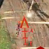
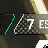

# Apex Legends Highlights Generator

Are you looking to create a highlights reel of your *best moments* in Apex Legends? Look no further! With this script, you can easily filter through your gameplay footage and extract only the most action-packed and exciting moments. Simply gather and label a dataset of interesting and not interesting frames, train a machine learning model, and let the script do the rest. The resulting video clip will feature all the *high-stakes battles* and *triumphant victories* you want to remember, without any of the dull downtime in between. Whether you're a seasoned pro or a newcomer to the game, this script is a must-have tool for any Apex Legends fan looking to relive their greatest moments.

## Features

- Automatically filters through gameplay footage and extracts only the most exciting moments
- Uses a machine learning model to classify frames as interesting or not
- Can be used to filter through any video file, not just Apex Legends gameplay footage (provided you create your own dataset)
- Can be used to filter through multiple video files at once
- Decide how many seconds of footage to include before and after each interesting frame
- Lightweight and easy to use

## Fast Start
- Install Python
- Install the dependencies
- In `main.py`, set `generate_inputs=True`. This will generate the inputs for the machine learning model.
- Sort the inputs in the `inputs` folder into 2 folders: `true` and `false`. The `true` folder contains the interesting frames, and the `false` folder contains the not interesting frames. You need to get at least 2k images in total. 
- Train the machine learning model using `ml.py`. This should not take too long.
- In `main.py`, set `generate_inputs=False`. This will use the machine learning model to filter the video.
- In `main.py`, set the `folder` variable to the path to the directory containing the video files to be filtered.

## Dependencies

Use the following command to install the dependencies:

`pip install -r requirements.txt`

## Usage

Run the script using the following command:

`python main.py`

The script will process each mp4 file in the specified directory and save the filtered clip as a new mp4 file with the same name as the original file.

## Machine Learning

The machine learning aspect of the script is handled in the `ml.py` file.

This file contains the code for training and evaluating the machine learning model used to classify the frames as interesting or not.

The specific implementation details of the machine learning model are not provided in this script.

## Dataset

You have to sort the pictures into 2 datasets. The proposed classes are :
- `true` : interesting frames
  - hit markers
  - 3 teams left
  - victory
- `false` : not interesting frames
  - nothing happens in the game
  - every screenshot that isn't Apex Legends

You need a minimum of 2k images in total.
Make sure to have diverse images in your dataset:
- different backgrounds: sky, buildings, explosions, etc.
- different weapons: snipers, shotguns, pistols, etc.
- different champions and their abilities
- if you choose to include the remaining teams counter, you need to have all of them (the 19).

It looks like it will take forever to sort the images, but it's actually pretty quick. 
You can sort 100 images per minutes if you use drag and drop.
The images will be shown in a chronological order, so there is a logic to where you need to look.

Make sure that your dataset is of *good quality*.
Any error in the sorting will impact heavely on the model.
If in doubt, remove the image from the dataset, you can always add more images later.

### Examples of interesting images

### Examples of not interesting images

### Can I use your dataset?

My dataset is not public for now but it will be in a near future. I'm currently working on a way to make it available to everyone.

That being said, I game in French, high settings, 4K and record at 60fps.
This means that the images in my dataset are *probably* not compatible with your game settings.
You will need to supplement the dataset with your own images.