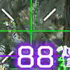
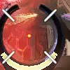
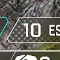

# Apex Legends Filtering Script

This script is designed to filter out interesting frames in an Apex Legends video record and save them to a new mp4 file. Interesting frames are defined as those where the player is dealing damage or near the champion. The interesting frames and the ones immediately before or after them are written to the filtered clip.

## Dependencies

This script requires the following Python packages:
- moviepy
- fastai
- numpy
- loguru
- tqdm

You can install these packages using pip:

`pip install -r requirements.txt`

## Usage

To use the script, modify the following variables at the bottom of the script:

- `folder`: the path to the directory containing the video files to be filtered
- `generate_inputs`: set to True to generate inputs for machine learning, False to filter the video using the machine learning model
- `input_generation_sampling`: if in input generation mode, this variable determines the frequency at which inputs are generated (one input every input_generation_sampling frames)
- `predict_sampling`: if in prediction mode, this variable determines the frequency at which frames are predicted (one prediction every predict_sampling frames). It seems like hit markers are visible for 15 or so frames. You will probably want to set this variable to less.
- `keep_after`: the number of seconds to keep after an interesting frame
- `keep_before`: the number of seconds to keep before an interesting frame

Once the variables are set, run the script using the following command:

`python apex_legends_filtering.py`

The script will process each mp4 file in the specified directory and save the filtered clip as a new mp4 file with the same name as the original file.

## Machine Learning

The machine learning aspect of the script is handled in the `ml.py` file. This file contains the code for training and evaluating the machine learning model used to classify the frames as interesting or not. The specific implementation details of the machine learning model are not provided in this script.

## Dataset

You have to sort the pictures into 2 datasets. The proposed classes are :
- `true` : interesting frames
  - hit markers
  - 3 teams left
  - victory
- `false` : not interesting frames
  - nothing happens in the game
  - every screenshot that isn't Apex Legends

### Examples of interesting images

### Examples of not interesting images

